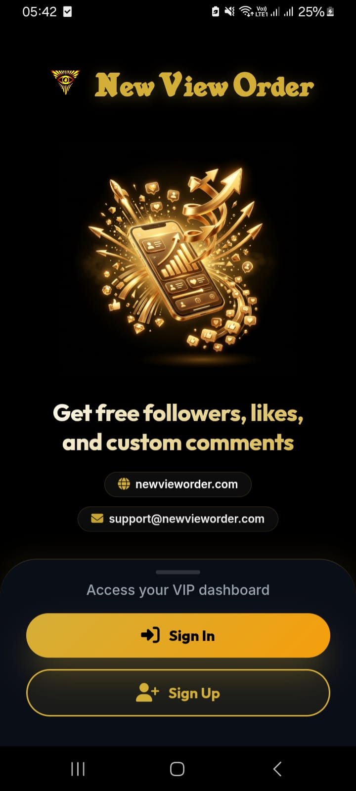
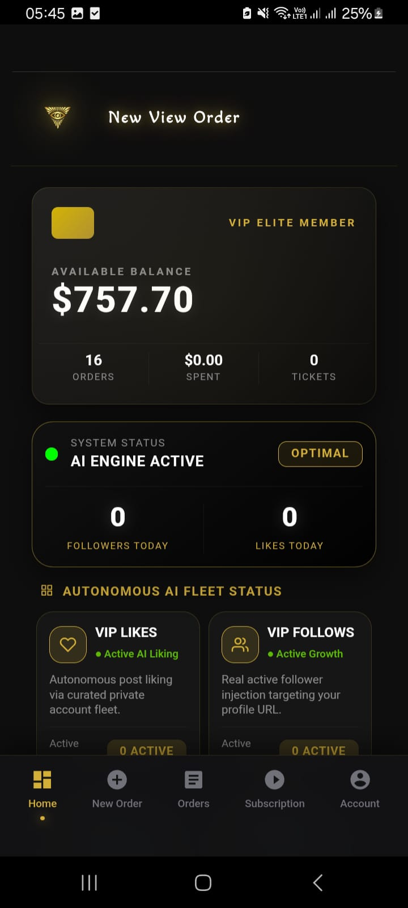
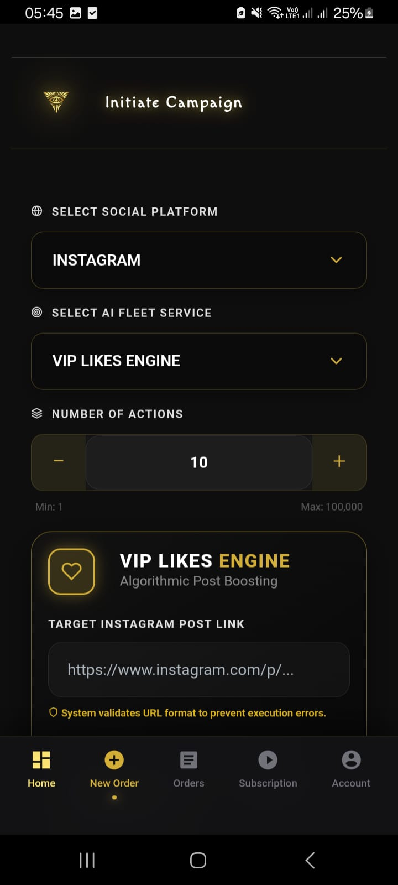
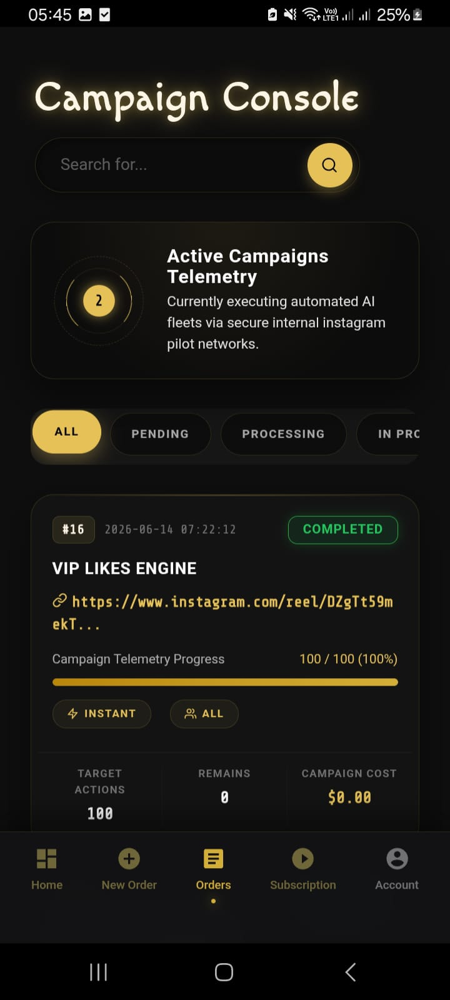

# Instagram Engagement Bot (SmartPanel Ecosystem)

[](https://www.python.org/)
[](https://www.php.net/)
[](https://opensource.org/licenses/MIT)

An advanced, automated Instagram SMM (Social Media Marketing) panel backend and web application ecosystem. This project features Android app emulation, human-like account warm-up sequences, automated task processing, proxy rotation, and bulk account verification.

## Architecture

This repository contains the complete ecosystem, recently refactored into a clean, modular structure:

1. **`backend_python/`**: The Python-based automation engine. 
   - **`src/`**: Contains the core worker loops (`api_worker_server.py`, `warmup_server.py`, `checkpoint_solver.py`).
   - **`scripts/`**: Utility scripts for database maintenance, remote deployment, and account verification.
   - **`config/`**: Configuration management using `.env` files for secure credential storage.
2. **`web_panel_php/`**: The SmartPanel PHP frontend and API layer, built as a Progressive Web App (PWA). This acts as the command center where users place orders and the Python bots fetch their tasks.

## Core Features
* **Android Emulation**: Mimics legitimate Android devices to significantly reduce API blocks compared to standard web-based automation.
* **Smart Proxy Rotation**: Integrated IP rotation to evade location-based rate limits and detection.
* **Warm-up Engine**: Automatically ages new accounts by simulating human behavior (scrolling feeds, watching reels) before performing heavy actions.
* **Bulk Account Verifier**: Tests hundreds of accounts automatically, filtering out banned or SMS-challenged accounts in real-time.
* **Progressive Web App (PWA)**: A modern, installable web panel for managing tasks on any device.

## UI Showcase & Demo

Watch the full system in action (Video Demo):

<video src="./assets/Screen_Recording_Converted.mp4" controls="controls" muted="muted" width="100%"></video>

### Progressive Web App (SmartPanel)
The user-facing dashboard is designed as a sleek, dark-themed PWA.

| Login Screen | Home Dashboard |
|:---:|:---:|
|  |  |
| **New Order Campaign** | **Orders Console** |
|  |  |

## Getting Started (Backend)

### Prerequisites
* Python 3.9+
* PHP 8.0+ & MySQL Server
* PM2 (Process Manager)
* Rotating Proxy Subscription

### Installation

1. **Setup Environment Variables**:
   Navigate to the backend configuration and create your `.env` file:
   ```bash
   cd backend_python/config
   cp .env.example .env
   # Edit .env with your actual database and server credentials
   ```

2. **Install Dependencies**:
   ```bash
   cd ../
   pip install -r requirements.txt
   ```

3. **Running the Bots**:
   Use PM2 to run the microservices continuously in the background:
   ```bash
   cd src/
   pm2 start api_worker_server.py --name "IG_Main_Worker"
   pm2 start warmup_server.py --name "IG_Warmup_Bot"
   ```

## Disclaimer
This project was developed strictly for **educational and automation testing purposes**. Use of this software to artificially inflate engagement metrics may violate Instagram's Terms of Service. Please use responsibly.
